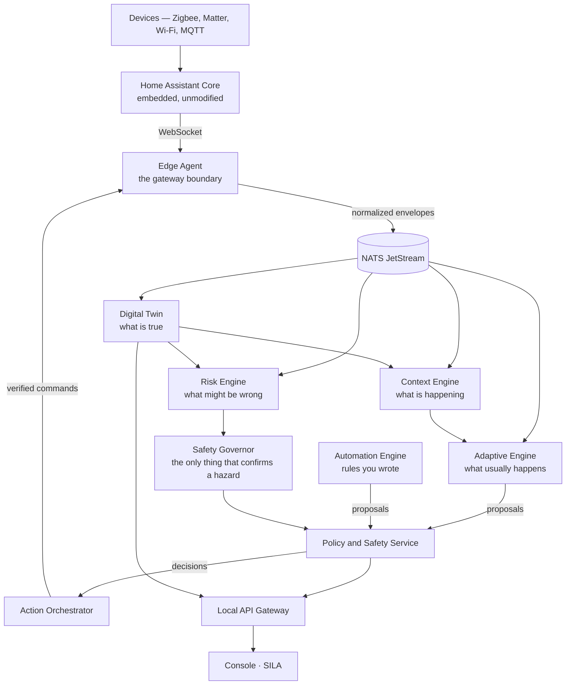

# SYLTRA Adaptive Edge Platform — what it is and how it works

A guide to the whole system for someone who owns it. It assumes no knowledge of
the codebase and explains the reasoning behind the parts that look unusual,
because most of them look unusual for a reason.

For phase-by-phase build history see `IMPLEMENTATION_STATUS.md`. For the safety
argument in evidence form see `docs/safety/SAFETY_CASE.md`. This document is the
map those two assume you already have.

---

## 1. What SYLTRA is

A **local-first adaptive smart-home platform**. It watches a home, learns its
patterns, and proposes things — turning the air conditioning on before you
arrive, noticing that a room has been getting damp for three days, telling you
a gas alarm is sounding.

Three commitments shape every technical decision:

**It runs in the house, not in a datacentre.** Losing the internet cannot affect
local control, because nothing local depends on the internet. There is no cloud
in the request path of anything.

**It proposes; people decide.** A model's output is advice until a person or a
deterministic rule authorises it. The gap between "SYLTRA thinks" and "SYLTRA
did" is the most carefully defended thing in the system.

**A person's hand always wins.** If you change something yourself, the platform
stands down.

### What it is not

Not a Home Assistant replacement, not a dashboard for your devices, and not a
chatbot with access to your house. Home Assistant is inside it as a component.
The product is the layer that reasons.

---

## 2. The load-bearing idea

> **Home Assistant is a device driver, not the product.**

Home Assistant is superb at speaking to thousands of devices, and that is a
problem nobody should solve twice. So SYLTRA embeds it — unmodified — and treats
it as a replaceable integration runtime behind one interface
(`DeviceIntegrationGateway`).

Above that boundary, nothing knows Home Assistant exists. Services speak only in
**canonical capabilities**: `environment.temperature`, `light.brightness`,
`safety.gas_alarm`. There are 31 of them, each with a declared type, unit,
range, safety class, freshness requirement and confirmation level.

The consequence: replacing Home Assistant with native Matter or Zigbee adapters
means writing **one new gateway adapter**, not rewriting the intelligence layer.
It also means Home Assistant's terminology never reaches a household — a test
sweeps every stylesheet and script to make sure.

*(ADR-001, ADR-004.)*

---

## 3. How a fact becomes an action



Read it as a sentence: **devices → Home Assistant → normalised events → four
independent readers → one gate → one actor → back to the devices.**

The narrow waist is deliberate. Everything that could change a home passes
through the Policy and Safety Service, and everything that reaches a device
passes through the Action Orchestrator. Two chokepoints, both auditable.

---

## 4. The components

### Edge Agent — the boundary
Talks to Home Assistant, translates its vocabulary into canonical capabilities,
and publishes. It suppresses duplicates, flags out-of-order events, and rejects
anything outside the capability model rather than guessing. An unrecognised
device is reported as unrecognised, not silently dropped.

### Digital Twin — what is true
The answer to "what is true in this home right now?", rebuilt deterministically
from the event stream. Replaying the same events always produces the same state,
verified by SHA-256 fingerprint.

Its most important property is that it distinguishes **known**, **stale** and
**unknown**. A reading past its capability's freshness window is stale, not
current — and every other component asks the twin `is_usable_for_decisions()`
rather than reading a value directly. A quiet home and a home whose sensors
stopped reporting look identical unless something insists on the difference.

### Context Engine — what is happening
Turns raw state into 13 deterministic situations: `HOME_OCCUPIED`, `SLEEPING`,
`COOKING`, `QUIET_HOURS`, `PROTECTION_GAP`… Each carries **evidence**,
**confidence** and an **expiry**. A context that nobody refreshed does not linger
as a fact; it expires.

Deterministic, not learned. The reasoning layer needs ground it can trust.

### Adaptive Engine — what usually happens
Where machine learning enters, and therefore where the constraints tighten.
Three baseline models (comfort preference, daily routine, energy anomaly),
trained locally, exported to ONNX, never leaving the hub.

It moves through a **learning ladder**, one rung at a time:

```
DISABLED → OBSERVE → SHADOW → RECOMMEND → APPROVAL_REQUIRED → AUTHORIZED_AUTOMATION
```

A home cannot skip rungs. In `SHADOW`, predictions are recorded and compared
against what actually happened — the model is being marked, not trusted. A model
that stops matching the home suspends itself, and coming back requires promoting
a new version through the same gate.

### Risk Engine — what might be wrong
Watches for gas, water, fire, electrical and intrusion signals. It can raise
`WATCH` and `PRE_ALERT`. **It cannot raise `CONFIRMED`** — the type refuses to
construct one.

### Safety Governor — what is actually wrong
The only component that can confirm a hazard, and only from a **certified alarm**
reading through a fixed rule. Five confirmation rules, each naming the response
it authorises. It imports nothing from the Adaptive Engine, no model runtime and
no dataframe library — proven by a test that runs a fresh Python interpreter and
inspects what got loaded.

The distinction the whole product rests on:

| | Comes from | Can it act? |
|---|---|---|
| **Watch / pre-alert** | inference | never alone |
| **Confirmed** | a certified detector and a fixed rule | yes, under approval |

### Policy and Safety Service — the gate
Sixteen deterministic rules over every proposal. Five possible answers:

`ALLOW` · `DENY` · `REQUIRE_USER_APPROVAL` · `PREPARE_ONLY` · `ESCALATE_TO_FIXED_SAFETY_RULE`

It checks consent, quiet hours, rate limits, whether a person recently changed
the thing by hand, and whether the twin's value is fresh enough to act on. A
recommendation for a device whose state is unknown is refused — changing a value
you cannot read is not a safe action.

### Action Orchestrator — the only thing that touches a device
Re-fetches the policy decision immediately before dispatch rather than trusting
the caller. Verifies the resulting state. Retries only what is safe to retry.
Detects a manual override and cancels the pending action.

It also holds the switch described in §7.

### Automation Engine — rules you wrote
The one component a household authors. Typed rules — trigger, conditions,
actions — with no scripting language, deliberately. An automation may only touch
**non-critical** capabilities, and that is refused at construction: an automation
that would unlock a door cannot be built, stored or listed.

*(ADR-009 explains why not a DSL.)*

### Local API Gateway, console and SILA
One authenticated local API. A console in Arabic and English from a single set
of components. SILA is a structured intent interface — not free-text control of
a house.

---

## 5. The safety architecture

Eighteen invariants, listed in `docs/safety/SAFETY_CASE.md` with code, tests and
logs for each. The pattern that matters more than the list:

> **Make the dangerous state impossible to construct, not merely unreachable.**

Four examples of the same move:

- `ACT_SAFETY` appears in **no role**. Not by convention — the module raises at
  import time if it ever does, and a test runs it under `python -O` because
  `assert` is stripped there and a guarantee that vanishes under an optimisation
  flag is not a guarantee.
- `RiskProposal` **cannot hold `CONFIRMED`**. Inference has no way to express
  certainty.
- `ResponseStage` has **two members and no third**. There is no value meaning
  "execute", so no caller can construct one.
- `AutomationAction` **refuses a critical capability at construction**, so there
  is no later check to forget.

The reasoning: a rule enforced by review is a rule that holds until someone is
in a hurry. A rule enforced by the type system holds at 3am.

### What safety does *not* do

SYLTRA does not currently operate any actuator in response to a confirmed
hazard. A confirmed gas alarm **notifies** and **prepares** — it identifies the
valve, verifies it can be reached, computes the command — and stops. Execution
needs explicit product-owner approval, and is deliberately unbuilt.

---

## 6. What the household sees

A local console, in Arabic and English, from one set of components — Arabic is
genuine mirroring produced by `dir="rtl"` alone, not a forked stylesheet. 394
translated strings, both languages, enforced by tests in both directions.

Design decisions worth knowing:

- **Status is never colour alone.** Advisory is dashed, confirmed is solid,
  shadow is dotted. It reads correctly in greyscale and in high-contrast mode.
- **Unknown is shown, never hidden.** A blank cell reads as "nothing wrong",
  which is exactly what the platform does not know.
- **Absent capability is a designed state.** Where the platform cannot yet do
  something, the screen says so rather than looking finished.
- **No critical action is one-click.** The §21 confirmation pattern is built and
  reviewed, and nothing uses it yet because nothing can.

WCAG 2.2 AA: every colour pair verified by computation in both themes, reflow
checked at 200% and 400% zoom, and the accessible-name tree read.

---

## 7. Running it in a real home

The first run should be behind one switch:

```python
OrchestratorConfig(dispatch=DispatchMode.OBSERVE_ONLY)
```

Everything runs — events arrive, the twin projects, contexts resolve, models
train, policy decides, automations evaluate — and **nothing reaches a device**.
Each refusal records the command that was not sent.

That record is the point. A week in this mode answers the question a pilot
exists to ask: *what would SYLTRA have done in this house?* — before it is
allowed to do any of it.

The console says **"This hub is watching, not acting"** before anything else on
the page, and the dashboard's first panel reads *No* under "Hub can act on
devices".

`docs/pilot/PILOT_CHECKLIST.md` covers the rest, including what must be true
before dispatch is enabled: the week's refused commands **read, not counted**;
nothing in them unwelcome; the household agreeing; and someone present in the
house the first time it acts.

---

## 8. Running it on your machine

```bash
make bootstrap     # pinned Python, workspace packages, dev tools
make up            # Home Assistant, MQTT, NATS, PostgreSQL, SYLTRA services
make simulate      # a deterministic home, no infrastructure needed
make console       # the console and the component catalogue
make observe       # Prometheus and Grafana → 127.0.0.1:3001
make test          # unit and contract tests
make test-safety   # the safety suite, which needs nothing but Python
```

Every target is documented in `README.md`.

The simulator is worth knowing about: 17 virtual devices and 21 deterministic
scenarios, including hazards. You can watch a gas alarm confirm without a gas
alarm.

---

## 9. What is real, and what is not

Honesty about this is more useful than a feature list.

### Built and tested
Everything in §4, the safety architecture in §5, the console in §6, encrypted
backups, privacy export and deletion, and the observability stack.

**1,011 unit and contract tests · 314 safety tests · 94 integration · 13
end-to-end.** The safety suite needs nothing but Python — no database, no
broker, no network — which is the point of it.

### Deliberately not built
- **Execution of a confirmed-hazard response.** Needs your approval.
- **Installations and user management.** No backend; the navigation says so.
- **The visual automation builder.** Automations are created through the API.
- **The Cloud Connector.** Specified in §14.11, and `services/cloud-connector/`
  holds a placeholder. Nothing depends on it.

### Never tested against reality

*(The full inventory is in [`docs/GAPS.md`](GAPS.md).)*

**No part of this has run in a real home.** Every test is synthetic; the
simulator is deterministic; Home Assistant was verified in a container.

The gap between "1,011 tests pass" and "a gas alarm in a real kitchen at 3am" is
large, and this repository cannot close it. The observe-only mode in §7 exists
so that closing it can start safely.

---

## 10. Where to look for what

| Question | File |
|---|---|
| How was this built, phase by phase? | `IMPLEMENTATION_STATUS.md` |
| Why is safety trustworthy? | `docs/safety/SAFETY_CASE.md` |
| How do risk states move? | `docs/safety/RISK_STATE_MACHINE.md` |
| Why was X decided that way? | `docs/adr/` (9 records) |
| What does the API expose? | `docs/api/LOCAL_API.md` |
| How does an event become state? | `docs/architecture/EVENT_MODEL.md` |
| What data is held, and for how long? | `docs/privacy/` |
| Something is wrong in production | `docs/operations/RUNBOOK.md` |
| Going into a real home | `docs/pilot/PILOT_CHECKLIST.md` |
| Changing the interface | `docs/ui/DESIGN_SYSTEM.md` |
| **What is missing or unverified** | **`docs/GAPS.md`** |

---

## 11. The shape of the codebase

```
libs/          7 shared packages — contracts, eventing, security, observability,
               design tokens, operations, testing
services/     11 services — edge agent, twin, context, adaptive, automation,
               policy, orchestrator, risk, feedback, API gateway, cloud (stub)
apps/          the local console and the SILA interface
simulator/     virtual devices and 21 deterministic scenarios
contracts/     generated JSON Schemas, versioned
home-assistant/ the SYLTRA custom integration (HA Core itself is never modified)
tests/         cross-service: integration, end-to-end, safety, fault injection
docs/          31 documents
```

122 source files, 56 test files. Python 3.12, managed by `uv`. `ruff` and
`mypy --strict` across everything; `bandit` for security linting.

---

## 12. If you read only one thing

The platform is built around a single distinction, and everything else follows
from defending it:

> **What the system believes** and **what the system does** are different things,
> and the second requires an authority the first does not have.

A model believing your living room should be cooler is not permission to cool
it. A sensor reading suggesting gas is not a confirmed hazard. A confirmed
hazard is not permission to close a valve.

Each of those gaps is defended by a type that refuses to be constructed wrongly,
a gate that re-checks rather than trusts, and a test that fails when someone
tries. That is what the platform is.
