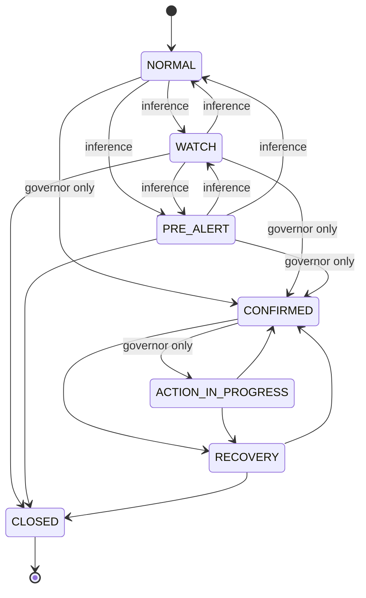

# Risk state machine

A risk case is SYLTRA's record of a possible hazard: what was seen, how sure the
platform is, and — most importantly — **whether that certainty came from
inference or from a certified alarm.**

## The seven states

| State | Meaning | Who can reach it |
|---|---|---|
| `NORMAL` | No case, or a case that has stood down | inference |
| `WATCH` | Something is unusual and worth following | inference |
| `PRE_ALERT` | A hazard signal is present but unconfirmed | inference |
| `CONFIRMED` | A certified alarm says the hazard is real | **Safety Governor only** |
| `ACTION_IN_PROGRESS` | An approved response is executing | **Safety Governor only** |
| `RECOVERY` | The hazard has cleared; the case is winding down | either |
| `CLOSED` | Terminal | either |

## The line that matters

`AI_REACHABLE_STATES` and `DETERMINISTIC_ONLY_STATES` are disjoint sets, and
`assert_transition` refuses a deterministic-only target unless the caller passes
`deterministic=True` — a flag only the Safety Governor sets. Three separate
mechanisms enforce it, so a single mistake cannot open the door:

1. **The transition guard.** Inference calling `assert_transition` toward
   `CONFIRMED` raises `UnauthorizedRiskTransition`, whatever its confidence.
2. **The proposal type.** `RiskProposal.__post_init__` rejects any state other
   than `WATCH` or `PRE_ALERT`, so a rule cannot even *construct* a confirmed
   proposal, let alone submit one.
3. **The record validator.** A `RiskCase` in a confirmed state must name the
   deterministic rule that confirmed it *and* carry at least one fresh,
   certified alarm reading. A case confirmed on inference fails validation.

## Three further properties

**A confirmed case cannot be downgraded.** Once confirmed, the paths forward are
response and recovery. There is no transition back to `WATCH` — the system
cannot quietly decide the emergency was only a watch after all.

**Recovery never jumps straight to normal.** A case is closed deliberately, so
there is always a record of who or what ended it.

**Advisory cases expire; confirmed cases do not.** A watch raised on a passing
anomaly ages out on its own (30 minutes for `WATCH`, 15 for `PRE_ALERT`). A
confirmed hazard stays open until someone or something resolves it — an
unattended emergency must not disappear because a timer ran out.

## What confirmation requires

Every one of these, for a single reading:

| Requirement | Why | Invariant |
|---|---|---|
| Origin is `CERTIFIED_ALARM` | Inference is not evidence of a hazard | 18 |
| The capability is one of the five approved alarm types | Claiming the origin is not enough | 18 |
| The reading is `KNOWN`, not `STALE` or `UNKNOWN` | Stale data cannot confirm | 4 |
| The reading is younger than `MAX_EVENT_AGE` (5 min) | A replay is not an alarm | 11 |
| The reading is not from the future | Clock skew is not a hazard signal | — |
| The value is `True` | An alarm reporting "no hazard" confirms nothing | — |

The approved capabilities are `safety.smoke_alarm`, `safety.heat_alarm`,
`safety.gas_alarm`, `safety.co_alarm` and `safety.water_leak`. Nothing else
confirms: high power, extreme temperature and an open door are all watches at
most, however alarming they look.

## Why absolute age is checked separately from freshness

`safety.water_leak` has a 300-second freshness window, wider than the gas
alarm's 120. A generous window is right for the twin — a leak detector that
reports every few minutes is still trustworthy — but it would become a replay
loophole if freshness were the only check. So the governor tests absolute age
against its own bound, independently of the capability's freshness requirement.

## What a confirmation authorizes

A named, fixed response per rule:

| Rule | Response |
|---|---|
| `gas_confirmed` | `NOTIFY_AND_ISOLATE_GAS` |
| `smoke_confirmed` / `heat_confirmed` | `NOTIFY_AND_UNLOCK_EGRESS` |
| `co_confirmed` | `NOTIFY_AND_VENTILATE` |
| `water_leak_confirmed` | `NOTIFY_AND_PREPARE_WATER_ISOLATION` |

A confirmed gas alarm authorizes gas isolation and nothing else — it is not a
licence to operate arbitrary devices. And the governor **authorizes**; it does
not execute. The Action Orchestrator carries the response out, under the same
policy gate as every other action (invariant 2).

## Interaction with comfort automation

An open confirmed case sets `active_risk` on the Policy Service, whose
`rule_active_risk_suspends_comfort_automation` then denies comfort actions.
Adaptive changes during an incident add noise exactly when the household and the
safety layer need a stable, predictable home.
