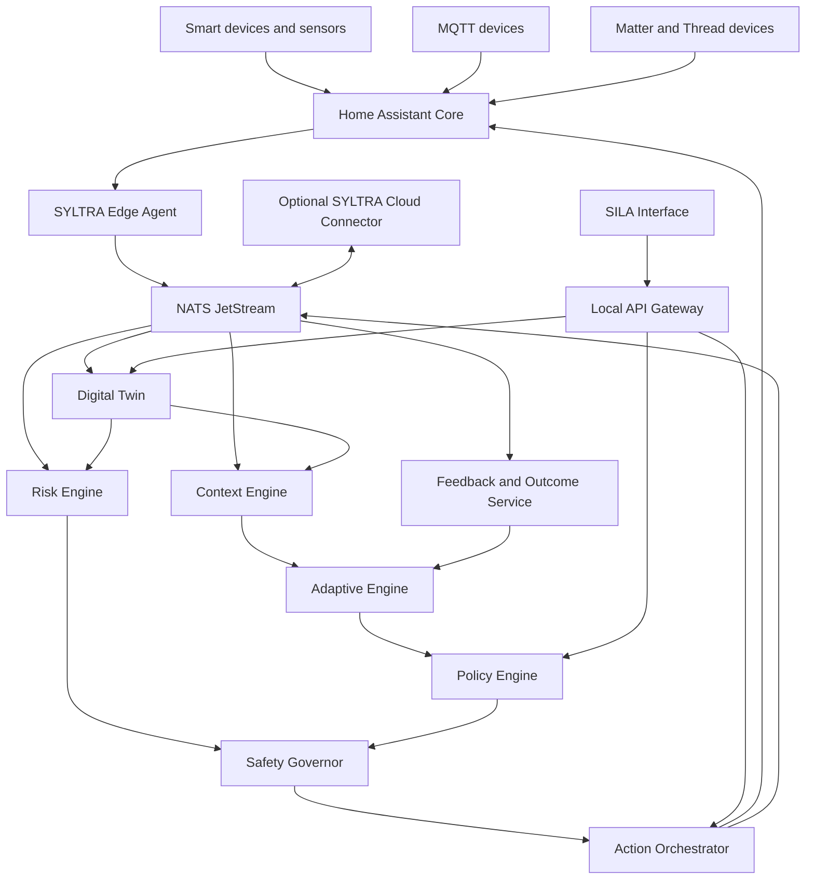

# SYLTRA Adaptive Edge Platform

## Master Build Specification for Claude Code

Version: 1.0  
Date: 2026-08-18  
Project type: Local-first adaptive smart-home platform  
Primary runtime: SYLTRA Hub development environment  
Language of code and technical documentation: English  
Required user-facing languages: Arabic RTL and English LTR

---

## 0. Instructions to Claude Code

You are the lead software architect and implementation engineer for the SYLTRA Adaptive Edge Platform.

Read this document completely before editing files or running commands.

Your job is to build a production-oriented MVP in the current repository. Work phase by phase. Do not skip foundations, tests, safety controls, or documentation to reach a visible demo faster.

### Execution rules

1. Inspect the repository before making changes.
2. If the repository is empty, initialize the structure defined in this document.
3. Create `IMPLEMENTATION_STATUS.md` and update it after every completed task.
4. Implement phases in the order defined in Section 22.
5. Before each phase:
   - restate the phase objective;
   - list affected files;
   - list acceptance tests;
   - identify safety and privacy implications.
6. After each phase:
   - run formatting, linting, type checks, unit tests, and relevant integration tests;
   - fix failures before continuing;
   - update `IMPLEMENTATION_STATUS.md`;
   - summarize what changed and what remains.
7. Ask a question only when a missing decision blocks implementation or materially changes safety, architecture, or data handling.
8. Never place secrets, tokens, passwords, certificates, or private keys in the repository.
9. Never deploy to production, connect to a real occupied home, or operate real safety actuators without explicit human approval.
10. Never allow a machine-learning model or LLM to directly execute emergency actions.
11. Never modify Home Assistant Core source code. Integrate through supported APIs and a separate SYLTRA integration.
12. Do not use cloud connectivity for local control dependencies.
13. Do not introduce a new framework, database, message broker, or programming language without recording an Architecture Decision Record.
14. Prefer simple, testable implementations over speculative complexity.
15. Keep every action idempotent, traceable, time-bounded, and reversible where the device supports reversal.
16. Manual user control always overrides adaptive automation.
17. Critical safety behavior must remain deterministic, independently testable, and available while AI services are offline.
18. Use latest stable dependency releases compatible with the selected Home Assistant version. Pin exact versions in lockfiles and record the compatibility matrix.
19. Do not commit or push unless explicitly instructed.
20. Do not claim a phase is complete unless every acceptance criterion passes.

### First response after reading this file

Return:

1. A concise repository assessment.
2. Any blocking questions.
3. A phase-by-phase execution plan.
4. The exact commands you intend to run for Phase 0.

If there are no blockers, begin Phase 0 after presenting the plan.

---

## 1. Product definition

SYLTRA is a smart-life and smart-home ecosystem.

SILA is the intelligent user interaction layer inside SYLTRA.

The product being built in this repository is the software intelligence and control platform that turns a conventional smart home into an adaptive, local-first system that:

- connects heterogeneous smart-home devices;
- maintains a live digital twin of the home;
- understands occupancy, activity, time, environment, and device context;
- discovers repeated routines;
- learns user preferences from explicit and implicit feedback;
- predicts likely next needs;
- detects abnormal behavior and early risk signals;
- proposes or executes permitted automations;
- applies deterministic safety rules before every action;
- continues core operation without internet access;
- explains decisions to the user through SILA;
- protects household privacy by keeping raw behavioral data local by default.

The proprietary product name for the intelligence layer is:

`SYLTRA Adaptive Edge Engine`

---

## 2. MVP objectives

The MVP must prove these four user outcomes:

### 2.1 Occupancy and context

Infer room and home occupancy using motion, contact, device tracker, time, and manual state inputs.

### 2.2 Adaptive comfort

Learn recurring air-conditioning, lighting, and curtain preferences and produce explainable recommendations.

### 2.3 Safe automation

Execute only user-authorized, non-critical actions through a policy and safety gate, then verify the resulting device state.

### 2.4 Early risk awareness

Detect abnormal gas, water, energy, temperature, connectivity, and device behavior. AI may create watch or pre-alert states. Confirmed emergency execution remains rule-based and requires approved safety inputs.

---

## 3. Non-goals for the MVP

Do not implement these in the initial MVP:

- custom PCB, enclosure, or production SYLTRA Hub hardware;
- autonomous life-safety certification claims;
- facial recognition or biometric identification;
- raw camera-video analysis;
- voice wake-word hardware;
- unrestricted natural-language control of safety devices;
- cloud-dependent local automation;
- full consumer mobile application;
- full commercial billing or subscription platform;
- marketplace for third-party automations;
- multi-building enterprise BMS functionality;
- reinforcement learning that explores actions in occupied homes;
- direct model control of gas valves, breakers, locks, or emergency exits;
- white-labeling or modifying the Home Assistant frontend.

---

## 4. Architecture principles

### 4.1 Local-first

Device events, current state, household context, personal routines, inference, policies, and action execution run on the local SYLTRA Hub environment.

### 4.2 Cloud-optional

Cloud services may provide account management, fleet health, software updates, model distribution, encrypted configuration backup, and opt-in aggregate analytics. Loss of internet must not stop local control.

### 4.3 Event-driven

All state changes, recommendations, decisions, actions, feedback, and risk transitions use immutable event envelopes.

### 4.4 Capability-based device abstraction

Intelligence services must not depend on vendor-specific entity names. Devices are represented through normalized capabilities.

### 4.5 Safety-governed

Model output is advisory until it passes policy, confidence, consent, freshness, conflict, and safety checks.

### 4.6 Explainable

Every adaptive recommendation and action must include reason codes, contributing signals, confidence, policy result, and final outcome.

### 4.7 Privacy-preserving

Raw household event history stays local by default. Cloud export requires explicit configuration and data minimization.

### 4.8 Replaceable components

Home Assistant, message transport, database, model runtime, and UI must sit behind internal interfaces so the platform is not permanently coupled to one implementation.

### 4.9 Mandatory architecture decision: Home Assistant boundary

For the MVP, use Home Assistant Core as an embedded, replaceable device-integration runtime inside the SYLTRA Hub environment.

Do not treat Home Assistant as the SYLTRA product core.

Do not fork, modify, or directly couple proprietary SYLTRA domain logic to Home Assistant internals.

The integration boundary is:

```text
Devices and protocols
        ↓
Home Assistant Core
        ↓ supported APIs
SYLTRA Device Integration Gateway / Edge Agent
        ↓ normalized SYLTRA contracts
SYLTRA Digital Twin, Context, AI, Risk, Policy, Actions, SILA and UI
```

Home Assistant responsibilities:

- device discovery and integrations;
- protocol-facing entity representation;
- entity and device registries;
- standard service calls;
- local state-change events;
- initial Matter, Zigbee, Thread, Wi-Fi, Bluetooth, and third-party integration support where available.

SYLTRA responsibilities:

- canonical capability model;
- event normalization and durable event history;
- digital twin;
- occupancy and context understanding;
- adaptive learning and inference;
- risk aggregation;
- policy and safety governance;
- action approval, orchestration, verification, and audit;
- SILA;
- SYLTRA application and local console;
- cloud connector and fleet lifecycle.

User-facing rule:

- The customer uses the SYLTRA application and interfaces.
- Home Assistant UI is a development and installer diagnostic tool only in the MVP.
- Do not copy, rebrand, or expose Home Assistant as the SYLTRA customer experience.

Decoupling requirement:

Create a `DeviceIntegrationGateway` interface owned by SYLTRA. The Home Assistant implementation is one adapter named `HomeAssistantDeviceGateway`. Core services may depend only on the SYLTRA interface and canonical contracts, never on Home Assistant entity objects or internal Python modules.

Required gateway operations:

```text
list_devices()
list_entities()
get_state()
subscribe_state_changes()
execute_capability_command()
get_device_health()
get_registry_snapshot()
```

Future replacement path:

SYLTRA may later add native Matter, Zigbee, or other gateway adapters. Replacing Home Assistant must not require rewriting the Digital Twin, Context Engine, Adaptive Engine, Risk Engine, Policy Service, Safety Governor, Action Orchestrator, SILA, or UI.

Record this decision as `docs/adr/ADR-001-home-assistant-as-replaceable-integration-runtime.md` during Phase 0.

---

## 5. Logical architecture



---

## 6. Deployment topology

### 6.1 Development topology

Use Docker Compose on a Linux-compatible development machine.

Required containers:

- Home Assistant Core;
- Eclipse Mosquitto;
- NATS with JetStream enabled;
- PostgreSQL with TimescaleDB extension where compatible;
- SYLTRA Edge Agent;
- SYLTRA Digital Twin Service;
- SYLTRA Context Engine;
- SYLTRA Adaptive Engine;
- SYLTRA Risk Engine;
- SYLTRA Policy and Safety Service;
- SYLTRA Action Orchestrator;
- SYLTRA Local API Gateway;
- SYLTRA Simulator;
- optional local observability services under a development profile.

### 6.2 Production target

The production target is a SYLTRA Hub with:

- Linux;
- containerized services;
- secure boot support;
- hardware-backed device identity where available;
- encrypted storage;
- Ethernet;
- Wi-Fi;
- Zigbee and Thread radios;
- local UPS or graceful shutdown support;
- signed update support.

Do not implement production hardware assumptions into business logic.

---

## 7. Technology stack

### 7.1 Core platform

- Linux containers
- Docker Compose for development and pilot deployment
- Python for MVP services
- FastAPI for local HTTP and WebSocket APIs
- Pydantic for contracts and validation
- SQLAlchemy for persistence
- Alembic for database migrations

### 7.2 Smart-home integration

- Home Assistant Core as the initial integration layer
- Home Assistant WebSocket API for event subscription and service calls
- Home Assistant REST API only where WebSocket is unsuitable
- MQTT 5 through Eclipse Mosquitto for compatible devices
- Matter Controller and Bridge integration through supported Home Assistant components

### 7.3 Messaging

- NATS Core for transient request and response
- NATS JetStream for durable event storage and replay
- explicit durable consumers
- dead-letter streams for poison or permanently failing events

### 7.4 Data

- PostgreSQL for relational data
- TimescaleDB for time-series events if compatible with the selected target
- JSONB only for extensible metadata, not as a substitute for core schema design
- UTC storage with original timezone offset retained in metadata

### 7.5 Machine learning

- NumPy
- pandas or Polars, select one and record the decision
- scikit-learn for MVP models
- ONNX for portable model artifacts
- ONNX Runtime for local inference
- joblib only for local development artifacts, never as the production model interchange format

### 7.6 Quality

- pytest
- pytest-asyncio
- Hypothesis for property-based tests where valuable
- testcontainers for integration tests
- Ruff for formatting and linting
- mypy with strict settings for core services
- Bandit or an equivalent Python security linter
- coverage reporting with critical safety modules requiring full branch coverage

### 7.7 Observability

- structured JSON logs
- OpenTelemetry traces and metrics
- Prometheus-compatible metrics endpoint
- correlation IDs across event, recommendation, decision, and action chains

### 7.8 UI

- minimal local operations console for the MVP
- responsive web UI
- Arabic RTL and English LTR
- no Home Assistant branding in the SYLTRA UI
- do not copy or re-skin Home Assistant frontend source

---

## 8. Repository structure

Create the following monorepo structure:

```text
syltra-adaptive-platform/
├── .claude/
│   ├── agents/
│   └── commands/
├── .github/
│   └── workflows/
├── apps/
│   ├── local-console/
│   └── sila-interface/
├── config/
│   ├── mosquitto/
│   ├── nats/
│   ├── home-assistant/
│   └── observability/
├── contracts/
│   ├── jsonschema/
│   ├── openapi/
│   └── examples/
├── docs/
│   ├── adr/
│   ├── architecture/
│   ├── safety/
│   ├── privacy/
│   ├── api/
│   ├── operations/
│   └── pilot/
├── home-assistant/
│   └── custom_components/
│       └── syltra_edge/
├── infrastructure/
│   ├── docker/
│   ├── migrations/
│   └── scripts/
├── libs/
│   ├── contracts/
│   ├── eventing/
│   ├── observability/
│   ├── security/
│   └── testing/
├── models/
│   ├── definitions/
│   ├── training/
│   ├── exported/
│   └── evaluation/
├── services/
│   ├── edge-agent/
│   ├── digital-twin/
│   ├── context-engine/
│   ├── adaptive-engine/
│   ├── risk-engine/
│   ├── policy-safety/
│   ├── action-orchestrator/
│   ├── feedback-service/
│   ├── api-gateway/
│   └── cloud-connector/
├── simulator/
│   ├── devices/
│   ├── scenarios/
│   └── fixtures/
├── tests/
│   ├── contract/
│   ├── integration/
│   ├── end_to_end/
│   ├── safety/
│   └── performance/
├── .env.example
├── .gitignore
├── CLAUDE.md
├── IMPLEMENTATION_STATUS.md
├── Makefile
├── README.md
├── SECURITY.md
├── THIRD_PARTY_NOTICES.md
├── docker-compose.yml
└── pyproject.toml
```

If the repository already has a compatible structure, adapt it rather than destructively replacing it.

---

## 9. Standard developer commands

Create a Makefile or equivalent task runner with these commands:

```text
make bootstrap       Install development prerequisites
make config-check    Validate configuration and environment
make up              Start the development platform
make down            Stop the development platform
make reset-demo      Reset demo data only, never user data
make seed            Load deterministic demo fixtures
make simulate        Run the default smart-home simulation
make test            Run unit and contract tests
make test-integration Run integration tests
make test-e2e        Run end-to-end tests
make test-safety     Run all safety scenarios
make lint            Run format, lint, and type checks
make security        Run security checks
make coverage        Produce coverage reports
make demo            Start the platform and deterministic demo
make logs            Tail structured service logs
make health          Show service health
```

Every command must be documented in `README.md`.

---

## 10. Canonical capability model

The intelligence layer must use normalized capabilities.

### 10.1 Sensor capabilities

```text
occupancy.motion
occupancy.presence
contact.open
environment.temperature
environment.humidity
environment.illuminance
environment.air_quality
safety.smoke_alarm
safety.heat_alarm
safety.gas_alarm
safety.co_alarm
safety.water_leak
energy.power
energy.current
energy.voltage
energy.consumption
device.online
device.battery
```

### 10.2 Actuator capabilities

```text
light.power
light.brightness
switch.power
climate.mode
climate.target_temperature
cover.position
lock.state
valve.state
breaker.state
siren.state
garage.state
camera.recording
notification.send
```

### 10.3 Capability requirements

Every capability definition must specify:

- data type;
- allowed unit;
- allowed range or enum;
- read, write, or read-write access;
- safety class;
- freshness requirement;
- reversibility;
- required confirmation level;
- vendor mapping;
- Home Assistant domain and service mapping.

Safety classes:

```text
NON_CRITICAL
COMFORT
SECURITY_SENSITIVE
SAFETY_RELATED
LIFE_SAFETY_CRITICAL
```

---

## 11. Event contracts

All events use a shared envelope.

### 11.1 Base event envelope

```json
{
  "event_id": "uuid",
  "event_type": "device.state.changed",
  "schema_version": "1.0",
  "occurred_at": "2026-08-18T15:30:00.000Z",
  "received_at": "2026-08-18T15:30:00.100Z",
  "home_id": "home_001",
  "correlation_id": "uuid",
  "causation_id": "uuid-or-null",
  "source": {
    "service": "edge-agent",
    "instance_id": "hub_001",
    "protocol": "home_assistant_websocket"
  },
  "subject": {
    "device_id": "device_001",
    "entity_id": "sensor.living_room_temperature",
    "room_id": "living_room"
  },
  "capability": "environment.temperature",
  "value": 27.4,
  "unit": "C",
  "quality": 0.98,
  "privacy_class": "HOUSEHOLD_PRIVATE",
  "metadata": {}
}
```

### 11.2 Required event types

```text
device.discovered
device.removed
device.availability.changed
device.state.changed
twin.state.updated
context.updated
routine.discovered
preference.updated
recommendation.created
recommendation.expired
policy.decision.created
risk.state.changed
action.requested
action.dispatched
action.succeeded
action.failed
action.cancelled
manual.override.detected
feedback.recorded
model.trained
model.activated
model.rolled_back
system.health.changed
```

### 11.3 Contract requirements

- Store JSON Schema for every event.
- Validate at publisher and consumer boundaries.
- Reject incompatible schema versions.
- Preserve unknown optional fields during relay.
- Use UUIDs for immutable event identifiers.
- Use idempotency keys for action requests.
- Keep raw and normalized event streams separate.
- Send invalid events to a dead-letter stream with reason codes.

---

## 12. NATS subject design

Use subjects similar to:

```text
syltra.raw.home.{home_id}.device.{device_id}
syltra.normalized.home.{home_id}.device.{device_id}
syltra.twin.home.{home_id}.updated
syltra.context.home.{home_id}.updated
syltra.ai.home.{home_id}.recommendation
syltra.risk.home.{home_id}.state
syltra.policy.home.{home_id}.decision
syltra.action.home.{home_id}.request
syltra.action.home.{home_id}.result
syltra.feedback.home.{home_id}.recorded
syltra.system.hub.{hub_id}.health
syltra.deadletter.{service}
```

Create explicit stream retention policies. Raw high-frequency data must have shorter retention than derived events. Retention must be configurable per privacy class.

---

## 13. Database model

Create normalized tables and migrations for at least:

```text
homes
hubs
rooms
room_relationships
occupants
occupant_permissions
devices
device_entities
device_capabilities
device_vendor_mappings
device_current_states
device_events
contexts
context_evidence
routines
routine_occurrences
preferences
recommendations
policy_rules
policy_decisions
risk_cases
risk_evidence
action_requests
action_attempts
action_results
manual_overrides
user_feedback
model_definitions
model_versions
model_assignments
system_health_events
audit_events
cloud_sync_checkpoints
```

### 13.1 Data rules

- Use UUID primary keys for domain objects.
- Use database constraints for valid state transitions.
- Use unique constraints for idempotency keys.
- Keep immutable events append-only.
- Keep current state separate from event history.
- Record actor, reason, and source for every sensitive change.
- Encrypt or tokenize direct user identifiers.
- Do not store microphone recordings, raw video, or biometric templates in the MVP.
- Provide deletion and export routines for household data.

---

## 14. Service specifications

### 14.1 Edge Agent

Responsibilities:

- authenticate to Home Assistant through a local token supplied securely;
- subscribe to `state_changed` and selected system events;
- collect initial entity and device registries;
- map Home Assistant entities to normalized capabilities;
- detect duplicates and out-of-order events;
- calculate source quality and freshness;
- publish raw and normalized events;
- expose health and metrics;
- reconnect with bounded exponential backoff;
- never persist the Home Assistant token in logs or events.

Acceptance criteria:

- reconnects after Home Assistant restart;
- publishes a normalized event within the configured latency target;
- rejects invalid entity mappings;
- handles duplicate and out-of-order events;
- marks unavailable devices correctly;
- redacts secrets from logs;
- includes contract and integration tests.

### 14.2 Digital Twin Service

Responsibilities:

- maintain current home, room, device, and capability state;
- maintain room adjacency and device location;
- expose point-in-time current state;
- calculate state freshness;
- represent unknown separately from false or off;
- publish `twin.state.updated` events;
- support deterministic rebuild from the event stream.

Acceptance criteria:

- rebuilds the same current state from an identical event sequence;
- ignores older state updates unless a correction event is used;
- survives service restart;
- returns explicit unknown and stale states;
- isolates data by home ID.

### 14.3 Context Engine

Responsibilities:

- infer contexts from current state and recent event windows;
- attach evidence and confidence;
- support overlapping contexts;
- expire contexts when evidence becomes stale;
- provide deterministic rules before ML inference;
- publish context updates only on material change.

Initial contexts:

```text
HOME_OCCUPIED
HOME_EMPTY
ROOM_OCCUPIED
SLEEPING
COOKING
ARRIVING
LEAVING
QUIET_HOURS
CHILD_PRESENT
HIGH_ENERGY_USAGE
POSSIBLE_WATER_LEAK
POSSIBLE_GAS_RISK
DEVICE_CONNECTIVITY_DEGRADED
```

Every context record must include:

- context type;
- scope;
- started time;
- last updated time;
- confidence;
- evidence references;
- expiry time;
- producing rule or model version.

### 14.4 Adaptive Engine

Responsibilities:

- discover repeated routines;
- learn comfort preferences;
- predict likely near-term states or needs;
- detect non-safety anomalies;
- generate recommendations, never direct actions;
- run in shadow mode before activation;
- support per-home models;
- export and run production inference through ONNX Runtime;
- track model quality and drift;
- support rollback.

Initial models:

1. Routine baseline using weekday and time buckets with exponentially weighted frequency.
2. Occupancy fusion using deterministic evidence plus a calibrated probabilistic model.
3. Temperature preference model using contextual regression.
4. Recommendation acceptance model using explicit feedback.
5. Energy anomaly model using robust statistics, then Isolation Forest after enough data.
6. Device anomaly model based on availability, state duration, and event frequency.

Do not train a model until minimum sample and diversity requirements are met. Define these requirements in configuration and tests.

### 14.5 Risk Engine

Responsibilities:

- aggregate risk evidence;
- detect abnormal sensor combinations;
- create and update risk cases;
- assign severity and confidence;
- distinguish AI pre-alerts from certified alarm states;
- publish risk-state transitions;
- never dispatch device actions.

Risk categories:

```text
GAS
SMOKE_FIRE
CARBON_MONOXIDE
WATER_LEAK
ELECTRICAL
TEMPERATURE
INTRUSION
DEVICE_FAILURE
CONNECTIVITY
```

Risk states:

```text
NORMAL
WATCH
PRE_ALERT
CONFIRMED
ACTION_IN_PROGRESS
RECOVERY
CLOSED
```

### 14.6 Policy and Safety Service

Responsibilities:

- evaluate consent;
- evaluate action safety class;
- enforce confidence thresholds;
- enforce freshness and data-quality thresholds;
- enforce quiet hours and household rules;
- detect conflicts with recent manual control;
- require approval where configured;
- enforce action rate limits and cooldowns;
- apply deterministic life-safety rules;
- output allow, deny, require approval, or prepare-only decisions;
- record reason codes and evidence.

Policy outcomes:

```text
ALLOW
DENY
REQUIRE_USER_APPROVAL
PREPARE_ONLY
ESCALATE_TO_FIXED_SAFETY_RULE
```

### 14.7 Action Orchestrator

Responsibilities:

- accept approved action requests;
- create an idempotency key;
- recheck current state before dispatch;
- call Home Assistant services;
- wait for expected state transition;
- retry only safe retryable failures;
- cancel when a manual override is detected;
- execute compensating action where valid;
- record complete action results;
- publish action lifecycle events.

No action may execute without:

- an approved policy decision;
- a non-expired TTL;
- a known target mapping;
- a valid safety class;
- a correlation ID;
- an audit record.

### 14.8 Feedback Service

Responsibilities:

- record accept, reject, not-now, modify, undo, and never-repeat feedback;
- connect feedback to the original recommendation and action;
- update preference evidence;
- reduce confidence after repeated rejection or undo;
- prevent feedback loops caused by automation-generated state changes.

### 14.9 Local API Gateway

Responsibilities:

- expose authenticated local APIs;
- enforce home and user authorization;
- aggregate read models for the UI;
- provide WebSocket event streaming;
- generate and publish OpenAPI documentation;
- rate-limit sensitive endpoints;
- avoid exposing internal NATS or database details.

### 14.10 SILA Interface

MVP responsibilities:

- receive structured intents, not unrestricted commands;
- explain recommendations and decisions;
- request user approval;
- collect feedback;
- report home and risk status;
- never bypass policy or safety services;
- never convert an LLM output directly into an actuator call.

Natural-language processing may be stubbed behind an interface in the MVP. A deterministic intent payload must be used between SILA and the platform.

### 14.11 Cloud Connector

MVP responsibilities:

- remain disabled by default;
- expose a clear data-export allowlist;
- synchronize only approved configuration and aggregate metrics;
- queue non-critical sync while offline;
- never proxy local action execution;
- redact household-private event payloads unless explicitly enabled.

---

## 15. Recommendation contract

```json
{
  "recommendation_id": "uuid",
  "home_id": "home_001",
  "recommendation_type": "climate.precondition",
  "created_at": "2026-08-18T15:30:00Z",
  "expires_at": "2026-08-18T15:45:00Z",
  "target": {
    "device_id": "ac_living_01",
    "capability": "climate.target_temperature"
  },
  "proposed_value": 23,
  "confidence": 0.87,
  "reason_codes": [
    "EXPECTED_ARRIVAL",
    "REPEATED_USER_PATTERN",
    "INDOOR_TEMPERATURE_HIGH"
  ],
  "evidence_event_ids": ["uuid", "uuid"],
  "model": {
    "name": "comfort_preference",
    "version": "1.0.0"
  },
  "required_policy": "COMFORT_AUTOMATION",
  "requires_user_approval": true
}
```

---

## 16. Policy decision contract

```json
{
  "decision_id": "uuid",
  "recommendation_id": "uuid",
  "decision": "REQUIRE_USER_APPROVAL",
  "evaluated_at": "2026-08-18T15:30:01Z",
  "expires_at": "2026-08-18T15:45:00Z",
  "reason_codes": [
    "AUTOMATION_NOT_YET_TRUSTED",
    "FIRST_WEEK_OF_PILOT"
  ],
  "safety_class": "COMFORT",
  "policy_version": "1.0.0",
  "input_hash": "sha256"
}
```

---

## 17. Action contract

```json
{
  "action_id": "uuid",
  "idempotency_key": "home_001:recommendation_uuid:action_1",
  "decision_id": "uuid",
  "home_id": "home_001",
  "target": {
    "device_id": "ac_living_01",
    "home_assistant_entity_id": "climate.living_room"
  },
  "service": {
    "domain": "climate",
    "name": "set_temperature",
    "data": {
      "temperature": 23
    }
  },
  "expected_state": {
    "capability": "climate.target_temperature",
    "operator": "equals",
    "value": 23
  },
  "timeout_seconds": 10,
  "max_attempts": 2,
  "expires_at": "2026-08-18T15:45:00Z",
  "safety_class": "COMFORT"
}
```

---

## 18. Safety invariants

These rules are mandatory and must be enforced in code and tests.

1. An AI recommendation is never an actuator command.
2. Every action passes through the Policy and Safety Service.
3. A stale recommendation cannot execute.
4. A stale sensor value cannot confirm a risk.
5. Manual user control cancels conflicting pending adaptive actions.
6. Emergency actions require deterministic approved conditions.
7. Loss of the Adaptive Engine does not stop fixed automations or safety monitoring.
8. Loss of cloud connectivity does not stop local control.
9. Loss of the database must fail safely and prevent untraceable adaptive execution.
10. Duplicate events do not produce duplicate actions.
11. Replayed historical events cannot trigger live actions.
12. Every sensitive action has an immutable audit trail.
13. Locks, gas valves, breakers, and emergency exits use separate policy classes.
14. A model cannot raise its own permission level.
15. A model version cannot activate without evaluation and explicit promotion.
16. Development and simulation environments must block real critical actuator targets.
17. Safety rules must be testable without ML services running.
18. Critical rules must use approved sensor alarm states and device capabilities, not inferred text or LLM output.

Create `docs/safety/SAFETY_CASE.md` mapping each invariant to code, tests, logs, and operator controls.

---

## 19. Adaptive-learning lifecycle

### 19.1 Modes

```text
DISABLED
OBSERVE
SHADOW
RECOMMEND
APPROVAL_REQUIRED
AUTHORIZED_AUTOMATION
SUSPENDED
```

### 19.2 Required progression

1. `OBSERVE`: collect validated local data.
2. `SHADOW`: generate predictions without showing or executing them.
3. `RECOMMEND`: show recommendations and collect feedback.
4. `APPROVAL_REQUIRED`: permit execution only after explicit approval.
5. `AUTHORIZED_AUTOMATION`: permit configured low-risk actions within policy limits.
6. `SUSPENDED`: stop adaptive execution after drift, repeated rejection, sensor degradation, or safety events.

No home may skip directly from `OBSERVE` to `AUTHORIZED_AUTOMATION`.

### 19.3 Model requirements

Every model version must include:

- name;
- version;
- model type;
- training data window;
- feature schema version;
- training code revision;
- evaluation metrics;
- calibration result;
- supported hardware/runtime;
- created time;
- promoted time;
- rollback target;
- privacy classification;
- model card.

### 19.4 Drift and suspension

Suspend the model when:

- input feature distribution changes beyond configured limits;
- device mappings materially change;
- acceptance rate falls below configured limits;
- undo or manual-override rate rises above configured limits;
- model inference fails repeatedly;
- confidence calibration becomes invalid;
- required sensors become stale or unavailable.

---

## 20. Initial use cases

### 20.1 Adaptive air conditioning

Inputs:

- room temperature;
- outdoor temperature if available;
- occupancy and arrival context;
- time and weekday;
- recent manual target changes;
- energy policy;
- user feedback.

Output:

- recommendation for mode, target temperature, and start time.

Safety:

- enforce allowed temperature range;
- respect manual override;
- suspend when temperature sensor is stale;
- rate-limit changes;
- do not control unsupported equipment modes.

### 20.2 Adaptive lighting

Inputs:

- occupancy;
- illuminance;
- time;
- room context;
- recent manual changes.

Output:

- recommendation for power and brightness.

Safety:

- do not turn off lights in configured safety areas;
- respect child, elder, accessibility, and night-path rules;
- restore safe lighting on sensor failure where configured.

### 20.3 Adaptive curtains

Inputs:

- time;
- occupancy;
- indoor temperature;
- sunlight or illuminance;
- privacy schedule;
- manual position changes.

Output:

- recommended position.

Safety:

- detect obstruction-capable device support;
- rate-limit movement;
- respect privacy and sleep contexts;
- stop on device fault.

### 20.4 Water-leak readiness

Inputs:

- certified leak detector state;
- water-flow signal if available;
- occupancy;
- appliance state;
- sensor freshness.

AI role:

- detect unusual patterns;
- enter `WATCH` or `PRE_ALERT`;
- notify and prepare the allowed response.

Fixed safety role:

- confirmed actions use deterministic approved rules.

### 20.5 Gas-risk readiness

Inputs:

- certified gas alarm state;
- cooktop state if supported;
- occupancy;
- ventilation state;
- sensor health.

AI role:

- combine context and raise early watch states.

Fixed safety role:

- confirmed alarm response follows deterministic approved rules only.

### 20.6 Energy anomaly

Inputs:

- whole-home power;
- circuit or device power where available;
- occupancy;
- time;
- device states.

Output:

- anomaly event with explanation and suspected contributors.

Do not automatically open a breaker based only on anomaly-model output.

---

## 21. Local API requirements

Implement versioned endpoints similar to:

```text
GET    /v1/health
GET    /v1/system/status
GET    /v1/homes/{home_id}/twin
GET    /v1/homes/{home_id}/rooms
GET    /v1/homes/{home_id}/devices
GET    /v1/homes/{home_id}/contexts/current
GET    /v1/homes/{home_id}/recommendations
GET    /v1/homes/{home_id}/recommendations/{id}
POST   /v1/homes/{home_id}/recommendations/{id}/feedback
POST   /v1/homes/{home_id}/recommendations/{id}/approve
POST   /v1/homes/{home_id}/recommendations/{id}/reject
GET    /v1/homes/{home_id}/risks
GET    /v1/homes/{home_id}/risks/{id}
POST   /v1/homes/{home_id}/actions/manual
GET    /v1/homes/{home_id}/actions/{id}
GET    /v1/homes/{home_id}/models
POST   /v1/homes/{home_id}/models/{id}/suspend
GET    /v1/audit
WS     /v1/stream
GET    /metrics
```

Requirements:

- OpenAPI specification;
- request validation;
- structured error model;
- authentication and authorization;
- correlation IDs;
- pagination;
- rate limits for mutations;
- audit logging;
- Arabic and English reason-code translations at the presentation layer.

---

## 22. Implementation phases

### Phase 0: Repository foundation

Deliver:

- repository structure;
- `CLAUDE.md` derived from this specification;
- `README.md`;
- `IMPLEMENTATION_STATUS.md`;
- `SECURITY.md`;
- `THIRD_PARTY_NOTICES.md`;
- Python workspace and lockfile;
- Docker Compose skeleton;
- Makefile commands;
- CI workflow;
- formatting, lint, types, unit-test baseline;
- initial ADRs;
- `.env.example` with non-secret placeholders.

Acceptance:

- bootstrap works on a clean supported machine;
- lint and tests pass;
- no secrets are committed;
- documentation explains the next phase.

### Phase 1: Infrastructure and Home Assistant connection

Deliver:

- working Home Assistant container;
- Mosquitto;
- NATS JetStream;
- PostgreSQL;
- Edge Agent WebSocket connection;
- health checks;
- initial capability mappings;
- deterministic simulator producing Home Assistant states.

Acceptance:

- platform starts with one command;
- Edge Agent receives state changes;
- normalized events appear in JetStream;
- restart and reconnect tests pass;
- invalid events reach dead-letter stream.

### Phase 2: Contracts and Digital Twin

Deliver:

- versioned schemas;
- database migrations;
- Digital Twin Service;
- state freshness;
- event replay and rebuild;
- home, room, and device APIs.

Acceptance:

- identical event sequence produces identical twin state;
- duplicate and out-of-order tests pass;
- multi-home isolation passes;
- state rebuild after reset passes.

### Phase 3: Context Engine

Deliver:

- deterministic initial contexts;
- evidence and confidence tracking;
- context expiry;
- simulated arrival, leaving, sleeping, cooking, and empty-home scenarios.

Acceptance:

- each context has evidence and expiry;
- missing sensors reduce confidence;
- stale evidence does not remain active;
- scenario tests pass deterministically.

### Phase 4: Adaptive Engine in shadow mode

Deliver:

- feature pipeline;
- routine baseline;
- temperature preference baseline;
- energy anomaly baseline;
- model registry;
- model cards;
- ONNX export and inference;
- shadow recommendations.

Acceptance:

- models never dispatch actions;
- training is reproducible;
- feature schema is versioned;
- inference output is validated;
- model rollback works;
- insufficient-data behavior is tested.

### Phase 5: Recommendations, policy, and actions

Deliver:

- recommendation lifecycle;
- feedback service;
- policy decisions;
- action orchestration;
- manual override detection;
- comfort actions for simulated AC, lights, and curtains.

Acceptance:

- no action without valid policy decision;
- duplicate requests cause one action;
- manual override cancels conflict;
- expired actions do not run;
- result verification works;
- failure and retry policy is tested.

### Phase 6: Risk and safety

Deliver:

- risk-case model;
- fixed risk state machine;
- gas, water, energy, sensor-health, and connectivity scenarios;
- Safety Governor;
- safety-case documentation;
- development blocks for critical real actuators.

Acceptance:

- AI only creates watch and pre-alert states;
- confirmed actions require deterministic conditions;
- safety tests pass without Adaptive Engine;
- replayed historical alarms cannot trigger live actions;
- loss of cloud has no local safety impact;
- all safety invariants map to tests.

### Phase 7: Local API, console, and SILA interface

Deliver:

- local API Gateway;
- Arabic RTL and English local console;
- live home state;
- recommendations and explanations;
- risk view;
- approval and feedback flows;
- structured SILA intent interface.

Acceptance:

- authorization isolates homes and roles;
- UI works in Arabic RTL and English LTR;
- SILA cannot bypass policy;
- reason codes are translated;
- accessibility checks pass.

### Phase 8: Pilot hardening

Deliver:

- deterministic pilot configuration;
- encrypted backup and restore;
- service watchdogs;
- resource limits;
- update and rollback design;
- observability dashboard;
- pilot runbook;
- privacy export and deletion tools;
- full fault-injection tests.

Acceptance:

- platform recovers after service and hub restart;
- internet loss does not stop local control;
- database backup and restore pass;
- model suspension and rollback pass;
- simulator runs continuously without unbounded resource growth;
- pilot checklist is complete.

---

## 23. Simulator requirements

The project must work without physical smart-home devices.

Create a simulator that provides:

- virtual rooms;
- motion and presence sensors;
- door and window contacts;
- temperature and humidity sensors;
- illuminance sensor;
- AC thermostat;
- lights;
- curtains;
- lock;
- leak sensor and water valve;
- gas alarm and gas valve;
- energy meter;
- camera availability state;
- device connectivity changes;
- manual user actions.

Required deterministic scenarios:

```text
normal_day
user_arrives_home
user_leaves_home
sleep_routine
manual_temperature_override
repeated_lighting_preference
water_leak_watch
water_leak_confirmed
gas_risk_watch
gas_alarm_confirmed
energy_anomaly
sensor_stale
device_offline
home_assistant_restart
edge_agent_restart
database_restart
internet_outage
duplicate_events
out_of_order_events
historical_event_replay
model_unavailable
policy_denied
action_timeout
```

Each scenario must produce expected events and assertions.

---

## 24. Testing strategy

### 24.1 Unit tests

Test pure business logic, mappings, validation, state transitions, policy rules, and model wrappers.

### 24.2 Contract tests

Validate every publisher and consumer against versioned schemas.

### 24.3 Integration tests

Use containerized NATS, PostgreSQL, MQTT, and a controlled Home Assistant instance or mock boundary.

### 24.4 End-to-end tests

Run simulator event through:

```text
Home Assistant -> Edge Agent -> Event Bus -> Twin -> Context -> Recommendation -> Policy -> Action -> Home Assistant -> Outcome
```

### 24.5 Safety tests

Cover every safety invariant and risk transition. Critical policy and safety modules require full branch coverage.

### 24.6 Property-based tests

Use for:

- event ordering;
- duplicate delivery;
- state rebuild;
- policy invariants;
- idempotency;
- time and expiry boundaries.

### 24.7 Fault injection

Test:

- service crashes;
- message redelivery;
- database latency;
- unavailable Home Assistant;
- stale sensor data;
- clock differences;
- disk-pressure behavior;
- network partition;
- corrupt model artifact;
- failed model inference;
- conflicting manual and adaptive commands.

### 24.8 Performance targets

Measure on documented reference development hardware.

Initial targets:

- support at least 100 simulated devices;
- support at least 50 normalized events per second in short bursts;
- normalized-event publish p95 under 250 ms;
- current-state update p95 under 500 ms;
- policy evaluation p95 under 200 ms;
- local model inference p95 under 250 ms for MVP models;
- no unbounded memory, disk, or stream growth.

Treat these as measured MVP targets, not safety guarantees.

---

## 25. Security requirements

### 25.1 Identity and access

- unique hub identity;
- unique service identity;
- role-based user authorization;
- least privilege;
- short-lived local access tokens where practical;
- separate permissions for comfort, security, and safety actions.

### 25.2 Network

- expose only the API Gateway and required Home Assistant interface;
- keep databases and message brokers on private container networks;
- authenticate MQTT and NATS;
- use TLS where connections cross a trust boundary;
- block default public listeners.

### 25.3 Secrets

- environment or secret-file injection;
- no secrets in logs;
- no secrets in images;
- `.env.example` contains placeholders only;
- documented rotation process.

### 25.4 Software supply chain

- pinned dependencies;
- dependency vulnerability scan;
- container image scan;
- software bill of materials;
- third-party notices;
- signed-release design for later pilot phases.

### 25.5 Audit

Audit:

- authentication events;
- permission changes;
- policy changes;
- model activation and rollback;
- recommendation approvals;
- sensitive actions;
- manual overrides;
- cloud export changes;
- data deletion and export.

---

## 26. Privacy requirements

Data classes:

```text
PUBLIC
SYSTEM_INTERNAL
HOUSEHOLD_PRIVATE
PERSONAL_SENSITIVE
SAFETY_CRITICAL
```

Rules:

- raw behavior events remain local by default;
- cloud sync uses an explicit allowlist;
- collect only data required for a declared feature;
- support per-feature consent;
- separate household and individual preference data;
- provide user data export;
- provide user and home deletion;
- document retention for every event stream and table;
- redact identifiers from diagnostic bundles;
- do not upload raw voice, raw video, or continuous location history in the MVP;
- use synthetic data in development and automated tests.

Create:

```text
docs/privacy/DATA_INVENTORY.md
docs/privacy/DATA_FLOW.md
docs/privacy/RETENTION_POLICY.md
docs/privacy/CONSENT_MODEL.md
```

---

## 27. Home Assistant integration requirements

Build a separate integration under:

```text
home-assistant/custom_components/syltra_edge/
```

Minimum files:

```text
manifest.json
__init__.py
config_flow.py
const.py
coordinator.py
diagnostics.py
services.yaml
strings.json
translations/ar.json
translations/en.json
```

Responsibilities:

- display SYLTRA Edge connection health;
- allow local configuration of the Edge Agent endpoint;
- expose diagnostics with secrets redacted;
- register only SYLTRA-specific services that do not duplicate standard entity services;
- use a unique integration domain;
- include config-flow tests;
- include translations;
- avoid overriding built-in integrations.

The separate Edge Agent remains responsible for general event normalization and action dispatch through supported Home Assistant APIs.

---

## 28. Local console requirements

The MVP console must show:

- system health;
- connected devices and availability;
- home and room state;
- current contexts with confidence and evidence;
- recommendations with reasons;
- approve, reject, not-now, modify, undo, and never-repeat feedback;
- risk cases and state;
- action timeline;
- model status and mode;
- privacy and cloud-sync controls;
- audit history appropriate to the user role.

The console must not expose raw tokens, broker credentials, or unrestricted actuator commands.

Arabic requirements:

- true RTL layout;
- Arabic translations for visible labels and reason codes;
- Arabic numerals or locale-aware formatting based on user preference;
- correct alignment for mixed Arabic and technical English terms.

---

## 29. Observability and operations

Every service must expose:

```text
/health/live
/health/ready
/metrics
```

Required metrics:

- event ingress rate;
- invalid-event rate;
- stream consumer lag;
- database latency;
- state-update latency;
- recommendation count;
- policy outcomes;
- action success and failure;
- manual override rate;
- model inference latency;
- model suspension count;
- stale sensor count;
- active risk cases;
- cloud connector status.

Required logs:

- JSON structured format;
- timestamp;
- service and instance;
- level;
- correlation ID;
- event or action ID where relevant;
- reason code;
- redacted error details.

---

## 30. Licensing and third-party boundaries

- Keep Home Assistant Core unmodified in its own container.
- Preserve required Apache 2.0 notices for Home Assistant Core.
- Do not present Home Assistant trademarks as SYLTRA property.
- Do not copy or rebrand the Home Assistant frontend.
- Maintain `THIRD_PARTY_NOTICES.md`.
- Record dependency licenses during CI.
- Flag incompatible or unclear licenses before adding a dependency.

---

## 31. Required documentation deliverables

Claude Code must create and maintain:

```text
README.md
IMPLEMENTATION_STATUS.md
SECURITY.md
THIRD_PARTY_NOTICES.md
docs/architecture/SYSTEM_OVERVIEW.md
docs/architecture/DEPLOYMENT.md
docs/architecture/EVENT_MODEL.md
docs/architecture/DIGITAL_TWIN.md
docs/architecture/CONTEXT_ENGINE.md
docs/architecture/ADAPTIVE_ENGINE.md
docs/architecture/POLICY_AND_ACTIONS.md
docs/safety/SAFETY_CASE.md
docs/safety/RISK_STATE_MACHINE.md
docs/privacy/DATA_INVENTORY.md
docs/privacy/DATA_FLOW.md
docs/privacy/RETENTION_POLICY.md
docs/privacy/CONSENT_MODEL.md
docs/api/LOCAL_API.md
docs/operations/RUNBOOK.md
docs/operations/BACKUP_RESTORE.md
docs/operations/INCIDENT_RESPONSE.md
docs/pilot/PILOT_CHECKLIST.md
```

Every major architecture choice requires an ADR in `docs/adr/`.

---

## 32. Definition of done for the MVP

The MVP is complete only when:

1. A clean machine starts the development stack using documented commands.
2. The simulator provides all required devices and scenarios.
3. Home Assistant state changes become normalized events.
4. The Digital Twin rebuilds deterministically from events.
5. Contexts include confidence, evidence, and expiry.
6. Adaptive models run locally and remain in controlled lifecycle modes.
7. Recommendations are explainable and never execute directly.
8. Policy and Safety Services gate every action.
9. The Action Orchestrator verifies outcomes and detects manual overrides.
10. Risk states distinguish AI pre-alert from deterministic confirmation.
11. Safety behavior works without the Adaptive Engine or cloud.
12. Arabic RTL and English local console flows work.
13. Logs, metrics, health checks, and audit records exist.
14. Security, privacy, backup, recovery, and pilot documentation exists.
15. Unit, contract, integration, end-to-end, safety, and fault tests pass.
16. No secrets or real household personal data exist in the repository.
17. Third-party licenses are documented.
18. `IMPLEMENTATION_STATUS.md` contains no unresolved critical blocker.

---

## 33. Final implementation behavior for Claude Code

When implementing this specification:

- do not attempt the entire platform in one uncontrolled change;
- finish and verify each phase before the next;
- keep code runnable after every phase;
- prefer deterministic simulators and tests over claims;
- show evidence for completion through command output and test results;
- record assumptions explicitly;
- stop when a safety-critical decision requires product-owner approval;
- never weaken a safety invariant to make a test pass;
- never hide a failing test or unsupported behavior;
- do not replace a real implementation with a placeholder unless the phase explicitly permits a stub;
- mark every stub clearly and track it in `IMPLEMENTATION_STATUS.md`;
- keep the platform local-first and vendor-abstracted;
- treat SILA as an interface, not the safety authority;
- treat the SYLTRA Adaptive Edge Engine as the proprietary orchestration, context, learning, policy, and safety layer above device integrations.

Start with Phase 0.
