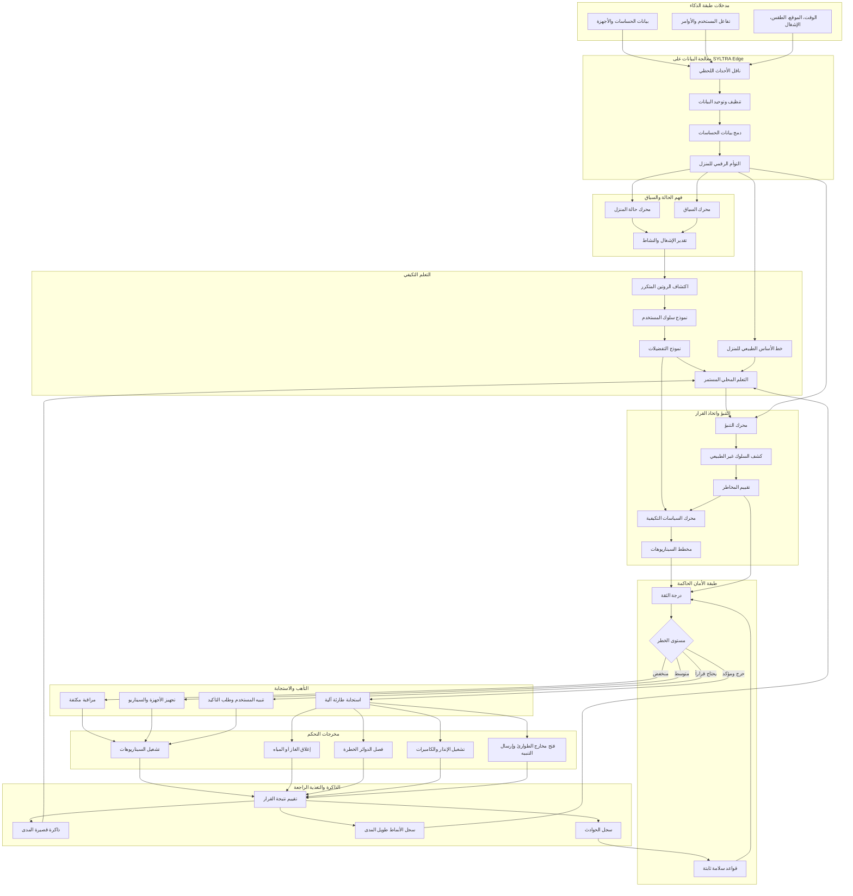

# SYLTRA — Adaptive Intelligence Layer

طبقة الذكاء التكيفي والتأهب للمخاطر

**LOCAL-FIRST · PRIVACY-PRESERVING · SAFETY-GOVERNED**

The target architecture as authored by the product owner. This file is the
source of truth for the design; it is reproduced here verbatim and is **not** a
description of what is currently implemented. See "Where the build actually
stands" at the bottom for that.

## Properties the graph asserts

Reading the edges rather than the boxes:

1. **Safety is a gate, not a monitor.** Every path from decision to actuation
   runs `T/R → V → W`. There is no edge from the decision layer straight to the
   control outputs. Nothing actuates without passing the trust score and the
   risk classifier.

2. **Emergency actuation is exclusive to the top tier.** `X`, `Y` and `Z` all
   converge on `AB` (run scenarios) only. Gas/water cut-off, circuit isolation,
   alarm, and exits (`AC`–`AF`) hang off `AA` alone. A medium-risk or
   awaiting-confirmation path can never reach a valve or a breaker.

3. **Two feedback loops with different destinations.** Short-term memory and the
   long-term pattern log feed `O` (continuous local learning). The incident log
   feeds `U` (fixed safety rules). Experience tunes the learner; incidents harden
   the rules. They are deliberately not the same loop.

4. **The digital twin fans out three ways.** `G` feeds context (`H`, `I`), the
   normal baseline (`N`), and the prediction engine (`P`) directly. It is the
   single shared representation the whole core reads from.

5. **Preferences reach policy without passing through prediction.** `M → S` is a
   direct edge, parallel to `R → S`. Policy is shaped by what the resident
   prefers and by measured risk, independently.

## Where the build actually stands

Mapping the graph's ~30 nodes onto the current codebase.

| Node | Status | Notes |
|---|---|---|
| A sensor/device data | partial | Edge Agent discovers HA entities; `device_states` table |
| B user interaction | partial | SILA intent classification, commands API |
| C time/location/weather/occupancy | **absent** | no weather, location, or occupancy source |
| D real-time event bus | partial | MQTT is transport only, not an event bus in this role |
| E clean/normalise | partial | `state-translator.ts` maps HA states to capability/value |
| F sensor fusion | **absent** | |
| G digital twin | **absent** | state is per-device rows; no home model |
| H, I, J context layer | **absent** | |
| K, L, M, N, O learning layer | **absent** | nothing learns today |
| P prediction | **absent** | |
| Q anomaly detection | **absent** | |
| R risk assessment | **absent** | |
| S adaptive policy engine | partial | `AdaptiveService` compiles objectives → constraints → commands, rule-based, no learned input |
| T scenario planner | partial | `AdaptivePlan`/`PlanStep` is a plan *structure*; scenes in the UI are hardcoded |
| U, V, W safety layer | **absent** | commands go straight from planner to device |
| X, Y, Z, AA response tiers | **absent** | no tiering |
| AB run scenarios | partial | commands execute; UI scenes are mock |
| AC–AF emergency outputs | **absent** | see blocker below |
| AG outcome evaluation | **absent** | reconciliation compares desired vs observed but does not judge decision quality |
| AH, AI memory | **absent** | |
| AJ incident log | partial | `device_events` logs plan lifecycle, not incidents |

### Three things to resolve before building

**The AI Core is specified as local, and is currently in the cloud.** The graph
places the pipeline and the core on SYLTRA Edge, and the footer claims
LOCAL-FIRST and PRIVACY-PRESERVING. `AdaptiveService` runs in `backend/api` —
the cloud. The Edge Agent is a thin translator with no decision logic. Building
this as drawn means moving the core to the edge, or the local-first property is
not true.

**The emergency actuators do not exist in the device model.** The Edge Agent's
capability mapper covers `climate`, `light`, `switch`, `cover`, `lock`, `sensor`,
`binary_sensor`. There is no gas valve, water valve, circuit breaker, siren, or
exit release. Layer 8's emergency branch (`AC`–`AF`) has nothing to command until
those device types and their Home Assistant domains are modelled. This is the
hard blocker on the most safety-critical part of the design.

**Safety-critical actuation needs a failure story the graph does not yet cover.**
Cutting gas, isolating circuits and releasing exits are irreversible and
life-safety relevant. What happens when the edge is offline, when a sensor is
faulty, or when `V` is uncertain, is not specified — and defaults matter more
here than anywhere else in the system.
